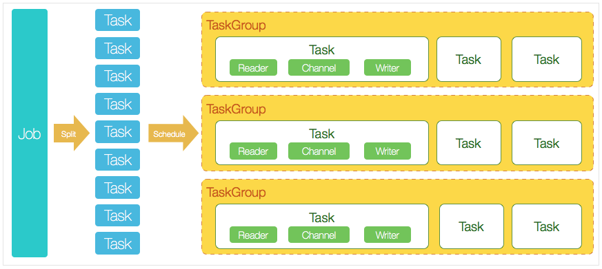

  <h1 align="center">Datax Data synchronization</h1>
  

    <a href="README.md"><strong>English</strong></a> | <strong>简体中文</strong>
  

## Table of Contents

- [Repository Introduction](#repository-introduction)
- [Prerequisites](#prerequisites)
- [Image Specifications](#image-specifications)
- [Getting Help](#getting-help)
- [How to Contribute](#how-to-contribute)

## Repository Introduction
‌[Datax‌](https://github.com/alibaba/DataX) DataX is an open-source heterogeneous data source offline synchronization tool developed by Alibaba.

**Core Features:**
1. Heterogeneous Data Source Support: DataX facilitates efficient data synchronization across various heterogeneous data sources, including relational databases (MySQL, Oracle, SQL Server, etc.), NoSQL (MongoDB, HBase), big data storage (HDFS, Hive), message queues (Kafka), and file systems (FTP, OSS/S3), covering enterprise-level data integration scenarios.
2. Distributed Architecture and High Scalability: Utilizing a framework + plugin design, with core scheduling and data read/write operations separated, it supports new data sources through expandable plugins. It supports multi-threaded concurrent read/write operations, linearly enhancing data transmission efficiency to meet TB-level data migration needs.
3. Breakpoint Continuation and Fault Tolerance Mechanism: Automatically records checkpoints during task execution, allowing recovery from breakpoints after abnormal interruptions to avoid redundant transmission. Provides dirty data detection and skip/record strategies to ensure task reliability.
4. Precise Data Consistency Assurance: Based on batch control (Batch) and transaction mechanisms, it ensures the atomicity and consistency of data synchronization. Supports full synchronization, incremental synchronization (such as based on timestamps or Binlog), and dynamic SQL filtering to meet different business scenario needs.
5. Low Resource Consumption and High Performance: Through memory optimization, streaming transmission, data sharding, and other technologies, it achieves a transmission rate of thousands per second on a single machine (depending on data source performance). Supports network compression transmission to reduce bandwidth usage.
6. Flexible Task Configuration and Monitoring: Provides JSON/script-based configuration methods, supporting dynamic parameter injection. Built-in task progress monitoring, rate statistics, dirty data ratio, and other metrics can be integrated with monitoring systems like Prometheus.
7. Enterprise-Level Security Support: Supports data transmission encryption (SSL/TLS), sensitive information desensitization, and data source permission control (such as Kerberos authentication) to meet security compliance requirements in financial, government, and other scenarios.
8. Ecosystem Compatibility: Seamlessly integrates with scheduling platforms like Alibaba Cloud DataWorks, supports linkage with big data components like MaxCompute and Flink. The open-source community provides a rich set of plugin extensions, allowing users to customize Reader/Writer plugins.

This project offers pre-configured [**`Datax-Data synchronization`**]()，images with Datax and its runtime environment pre-installed, along with deployment templates. Follow the guide to enjoy an "out-of-the-box" experience.

**Architecture Design:**

> **System Requirements:**
> - CPU: 4vCPUs or higher
> - RAM: 16GB or more
> - Disk: At least 50GB

## Prerequisites
[Register a Huawei account and activate Huawei Cloud](https://support.huaweicloud.com/usermanual-account/account_id_001.html)

## Image Specifications

| Image Version          | Description | Notes |
|------------------------| --- | --- |
| [Datax202309-kunpeng-v1.0](https://github.com/HuaweiCloudDeveloper/datax-image/tree/Datax202309-arm-v1.0?tab=readme-ov-file) | Deployed on Kunpeng servers with Huawei Cloud EulerOS 2.0 64bit |  |

## Getting Help
- Submit an [issue](https://github.com/HuaweiCloudDeveloper/datax-image/issues)
- Contact Huawei Cloud Marketplace product support

## How to Contribute
- Fork this repository and submit a merge request.
- Update README.md synchronously based on your open-source mirror information.